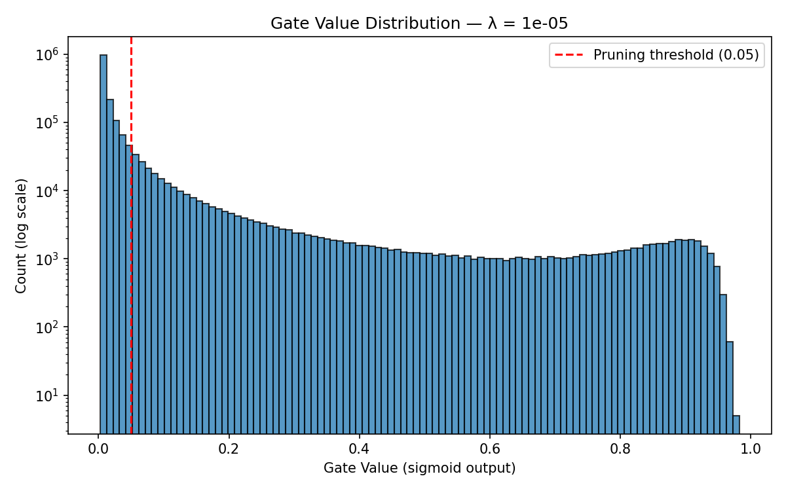

# Self-Pruning Neural Network

Tredence Analytics — AI Engineering Intern Case Study

A feed-forward neural network that **learns to prune itself** during training using learnable gate parameters on every weight. An L1 sparsity penalty on sigmoid-activated gates drives unimportant connections toward zero.

---

## Deliverables

| File | Description |
| ---- | ----------- |
| [`self_pruning_network.py`](self_pruning_network.py) | Single self-contained script — `PrunableLinear` layer, `SelfPruningNet` model, training loop, evaluation, and plots |
| [`REPORT.md`](REPORT.md) | Short report — L1 sparsity explanation, results table, gate distribution analysis |
| [`plots/gate_distribution_lambda_1e-05.png`](plots/gate_distribution_lambda_1e-05.png) | Gate value distribution for the best model (λ = 1e-05) |

---

## Quick Start

```bash
pip install -r requirements.txt
python self_pruning_network.py
```

CIFAR-10 is downloaded automatically on first run. Training runs for 3 λ values (30 epochs each). Results are saved to `checkpoints/` and `plots/`.

---

## Results

| Lambda | Test Accuracy (%) | Sparsity Level (%) |
| ------ | ----------------- | ------------------ |
| 1e-06  | 51.16             | 15.63              |
| 1e-05  | **53.73**         | **81.06**          |
| 0.0001 | 51.09             | 99.14              |

Best model: **λ = 1e-05** — 81% of weights pruned while retaining 53.73% test accuracy.

---

## Gate Distribution (Best Model)


